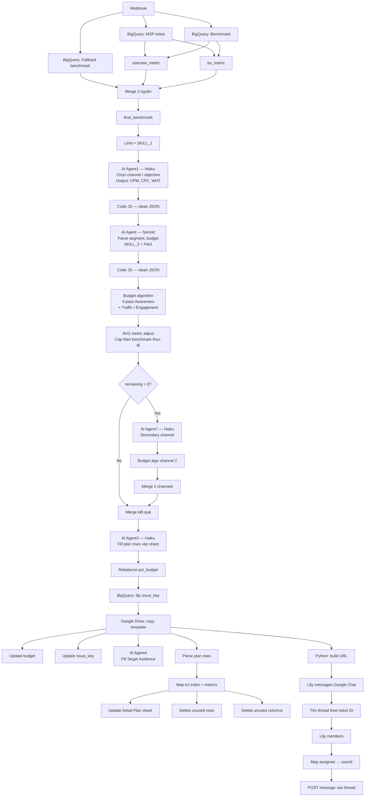

# AI Marketing Automation

AI-powered workflow for automating media plan generation using n8n and Claude AI.

## Overview

Hệ thống tự động tạo media plan từ Jira ticket — từ việc chọn channel/objective, tính toán phân bổ ngân sách, đến ghi kết quả vào Google Sheets và notify qua Google Chat.

## Tech Stack

- **n8n** — workflow automation
- **Claude AI** (Haiku + Sonnet) — AI agents
- **Google BigQuery** — data source (benchmark, ticket)
- **Google Sheets / Drive** — output template
- **Google Chat** — notification
- **PostgreSQL** — chat memory cho AI agents

## Flow Overview

## Các phase chính

| Phase | Mô tả |
|---|---|
| ① Data fetch | Kéo ticket data + benchmark từ BigQuery, merge theo priority: usecase > BU > fallback |
| ② AI Agent 1 | Chọn channel/objective mix, output CPM/CPC/WHT/channels_active |
| ③ AI Agent 2 | Parse segment sizes, match rate, budget, additional phases |
| ④ Budget algorithm | 4-pass awareness + phân bổ các objective còn lại, adjust theo AVG metric |
| ⑤ Secondary channel | Nếu còn remaining budget → chạy thêm channel 2, merge kết quả |
| ⑥ Output | Copy template Drive → điền Sheets → notify Google Chat với mention assignee |

## Docs

- [Budget Algorithm](docs/algorithm.md) — giải thích logic tính toán phân bổ ngân sách
